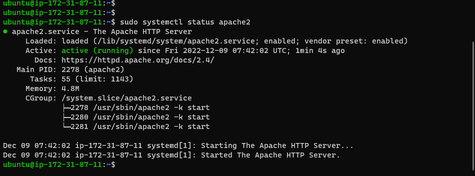
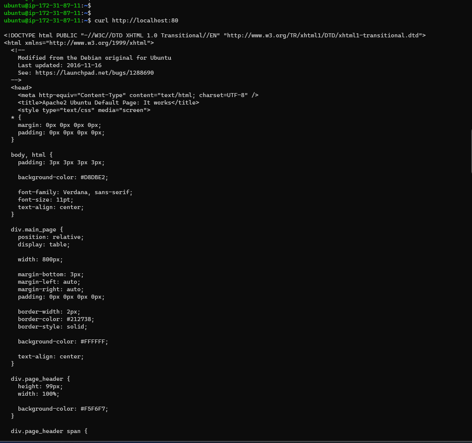

# PROJECT 1: LAMP STACK IMPLEMENTATION

> WEB STACK IMPLEMENTATION (LAMP STACK) IN AWS

- Create AWS account and set up ubuntu server

- Connected to the EC2 instance.

- Navigated to download to copy for the **.pem** file

> ## Step 1 - Installing Apache and updating the linux

- Install apache on ubuntu instance using the command below:

```
sudo apt update
sudo apt install apache2
sudo systemctl status apache2
```



- Check apache in the console


