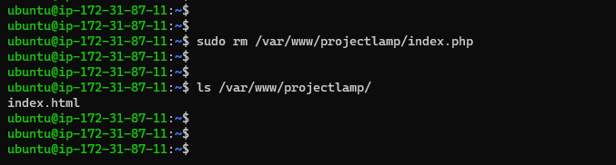

# PROJECT 1: LAMP STACK IMPLEMENTATION

> WEB STACK IMPLEMENTATION (LAMP STACK) IN AWS

- Create AWS account and set up ubuntu server

- Connected to the EC2 instance.

- Navigated to download to copy for the **.pem** file

> ## Step 1 - Installing Apache and updating the linux

- Install apache on ubuntu instance using the command below:

```
sudo apt update
sudo apt install apache2
sudo systemctl status apache2
```


- Check apache in the console


- Check apache in the browser


> ## Step 2 - Install MySQL

- To install mysql

```
sudo apt install mysql-server
sudo mysql
```


- Changed mysql password


> ## Step 3 - Install PHP

- To install these 3 packages at once, run

```
sudo apt install php libapache2-mod-php php-mysql
php -v
```


> ## Step 4 - Creating a virtual host for your website using Apache

```
sudo mkdir /var/www/projectlamp
sudo chown -R $USER:$USER /var/www/projectlamp
sudo vi /etc/apache2/sites-available/projectlamp.conf
```


