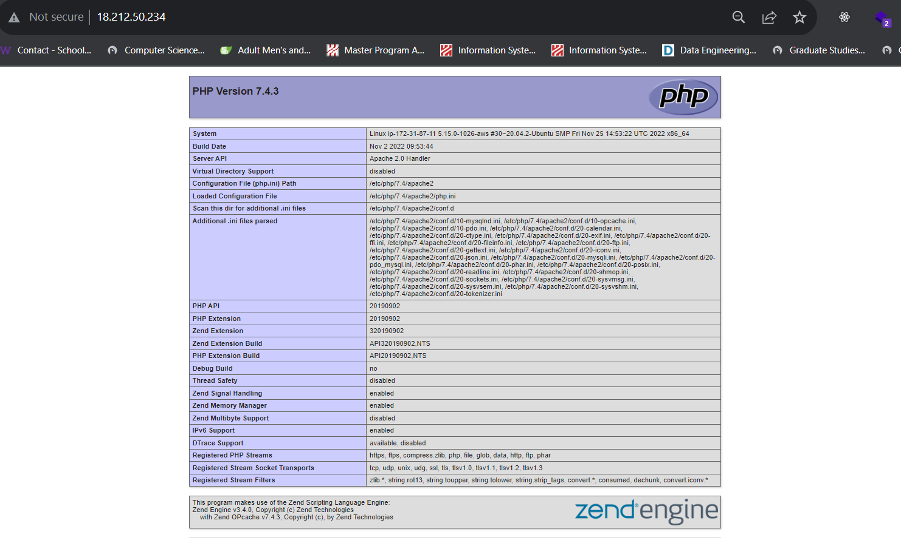

# PROJECT 1: LAMP STACK IMPLEMENTATION

> WEB STACK IMPLEMENTATION (LAMP STACK) IN AWS

- Create AWS account and set up ubuntu server

- Connected to the EC2 instance.

- Navigated to download to copy for the **.pem** file

> ## Step 1 - Installing Apache and updating the linux

- Install apache on ubuntu instance using the command below:

```
sudo apt update
sudo apt install apache2
sudo systemctl status apache2
```


- Check apache in the console


- Check apache in the browser


> ## Step 2 - Install MySQL

- To install mysql

```
sudo apt install mysql-server
sudo mysql
```


- Changed mysql password


> ## Step 3 - Install PHP

- To install these 3 packages at once, run

```
sudo apt install php libapache2-mod-php php-mysql
php -v
```


> ## Step 4 - Creating a virtual host for your website using Apache

```
sudo mkdir /var/www/projectlamp
sudo chown -R $USER:$USER /var/www/projectlamp
sudo vi /etc/apache2/sites-available/projectlamp.conf
```

- Create a config file in Apache's site-available directory using vi, vim or nano (preferred command-line editor).


- Create an index.html file in the location and view it on the browser

`sudo echo 'Hello LAMP from hostname' $(curl -s http://169.254.169.254/latest/meta-data/public-hostname) 'with public IP' $(curl -s http://169.254.169.254/latest/meta-data/public-ipv4) > /var/www/projectlamp/index.html`


- Edit the /etc/apache2/mods-enabled/dir.conf file and change the order in which the index.php file is listed within the DirectoryIndex directive:

`sudo vim /etc/apache2/mods-enabled/dir.conf`

- Save and close the file. Then reload the Apache so the changes can take effect.

`sudo systemctl reload apache2`

- Create a new file named `index.php` inside your custom web root folder:

`vim /var/www/projectlamp/index.php`

Open a blank file, add the following text, which is valid PHP code, inside the file:

```
<?php
phpinfo();
```

- Save and close the file, refresh the page and view in the browser:


