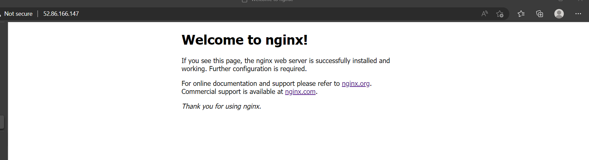
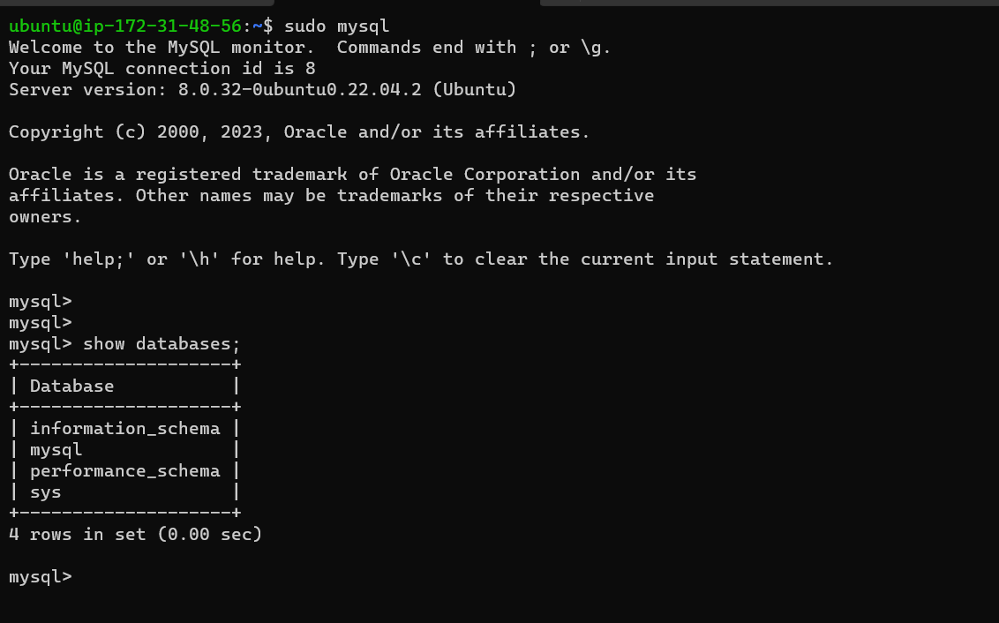
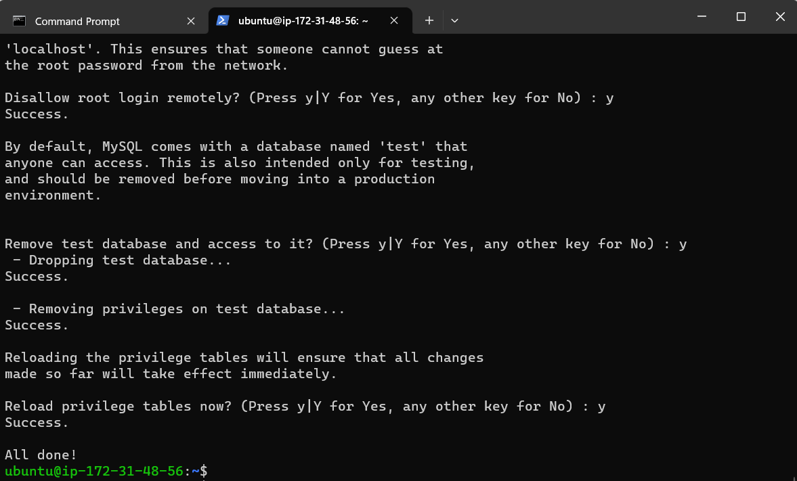
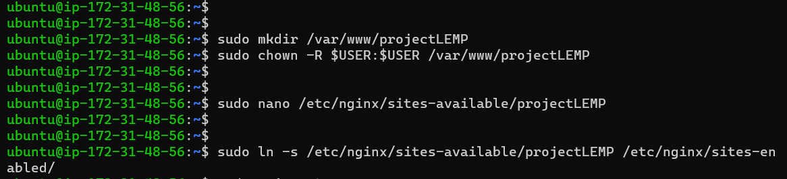
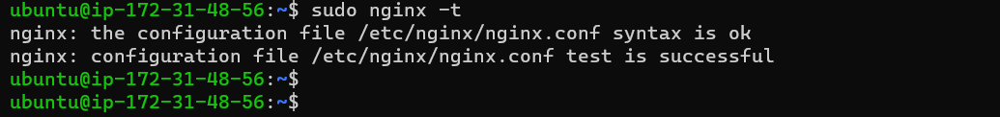
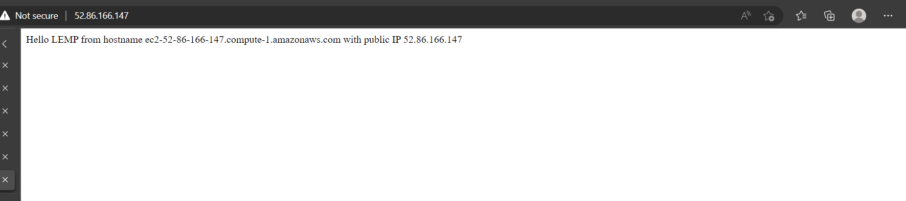
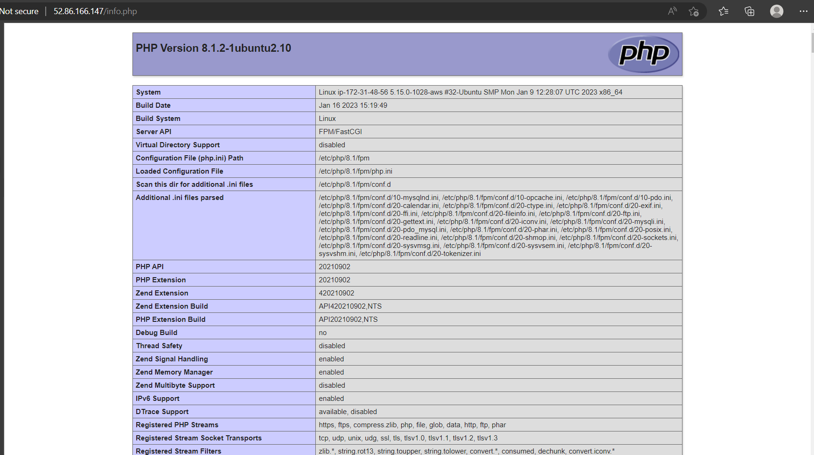

# PROJECT 2: LEMP STACK IMPLEMENTATION

> ## Step 1: Installing Nginx web server

- Create AWS account and set up ubuntu server

- Connect to the EC2 instance.

- Update the Ubuntu server and install nginx web server

```
sudo apt update
sudo apt install nginx
```

- Check the status of the Nginx web server to verify that nginx was successfully installed and is running as a service in Ubuntu, run:

`sudo systemctl status nginx`

- If it is green and running, then everything is working correctly – First Web Server is launched in the Cloud!

- To receive any traffic from the web server, open TCP port 80 which is the default port that web browsers use to access web pages in the internet.

- The web server is running and it can be accessed locally and from the Internet (Source 0.0.0.0/0 means ‘from any IP address’).

- To access it locally in our Ubuntu shell, run:

```
curl http://localhost:80
or
curl http://127.0.0.1:80
```

- To access the web server from the internet, open a web server and try to access the following url:

`http://<Public-IP-Address>:80`

- If you see following page, then your web server is now correctly installed and accessible through your firewall.



> ## Step 2: Install MYSQL

- Run the following command in the terminal to install mysql

`sudo apt install mysql-server`

- Once the installation is finished, log in to the MYSQL console by typing:

`sudo mysql`



- Reset the password for mysql and set the password strenght



> ## Step 3 - Install PHP

- Install PHP using the command below:

`sudo apt install php-fpm php-mysql`

> ## Step 4 - Configure Nginx to use PHP Processor

- We will create a domain to configure web directory

`sudo mkdir /var/www/projectLEMP`

- Assign ownership of the directory with the $USER environment variable, which will reference the current system user:

`sudo chown -R $USER:$USER /var/www/projectLEMP`

- Then, open a new configuration file in Nginx’s sites-available directory using your preferred command-line editor.

`sudo nano /etc/nginx/sites-available/projectLEMP`

- Crate a blank file and paste the code:



```
#/etc/nginx/sites-available/projectLEMP

server {
    listen 80;
    server_name projectLEMP www.projectLEMP;
    root /var/www/projectLEMP;

    index index.html index.htm index.php;

    location / {
        try_files $uri $uri/ =404;
    }

    location ~ \.php$ {
        include snippets/fastcgi-php.conf;
        fastcgi_pass unix:/var/run/php/php8.1-fpm.sock;
     }

    location ~ /\.ht {
        deny all;
    }

}
```

- Activate your configuration by linking to the config file from Nginx’s sites-enabled directory:

`sudo ln -s /etc/nginx/sites-available/projectLEMP /etc/nginx/sites-enabled/`

- Test the configuration using the code below:

`sudo nginx -t`

- The following result show be shown

```
nginx: the configuration file /etc/nginx/nginx.conf syntax is ok
nginx: configuration file /etc/nginx/nginx.conf test is successful
```



- Disable default Nginx host that is currently configured to listen on port 80, for this run:

`sudo unlink /etc/nginx/sites-enabled/default`

- Reload nginx to apply changes

`sudo systemctl reload nginx`

- Check the new website using the follow code below and paste in the browser

`sudo echo 'Hello LEMP from hostname' $(curl -s http://169.254.169.254/latest/meta-data/public-hostname) 'with public IP' $(curl -s http://169.254.169.254/latest/meta-data/public-ipv4) > /var/www/projectLEMP/index.html`



- Replace the index.html file with index.php file to show details of PHP
  and exit the index.php. In the file, type:

```
<?php
phpinfo();
```

- Check the broswer/info.php



> ## Step 6 - Retrieving Data from mysql database with php.

- Create a database and create a user. Also, texts are created to fill

```
sudo mysql
CREATE DATABASE `example_database`;
CREATE USER 'example_user'@'%' IDENTIFIED WITH mysql_native_password BY 'password';
GRANT ALL ON example_database.* TO 'example_user'@'%';
```
